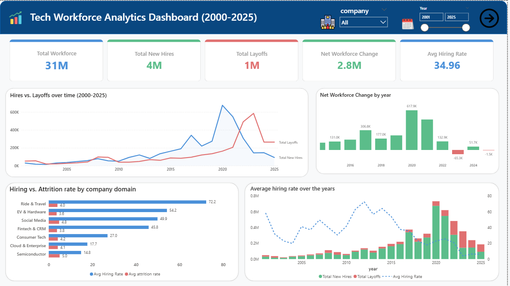
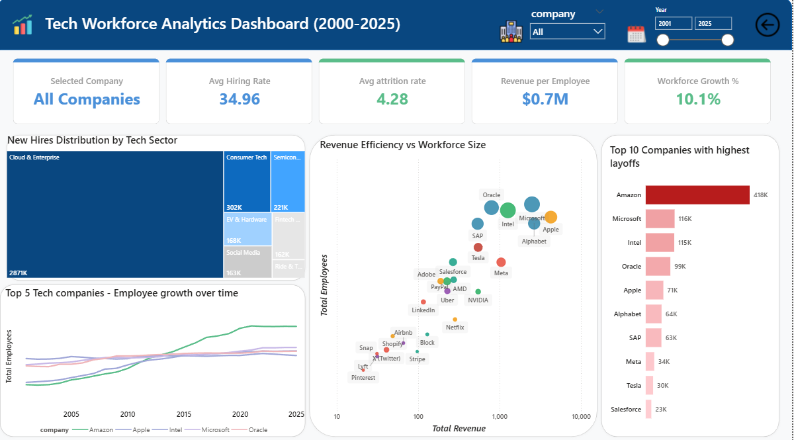

# 📊 Tech Workforce Analysis (2000–2025)

> Analyzing 25 years of hiring, layoffs, and revenue trends across 25 major technology companies.

---

## 1. Project Background

The technology industry has been one of the most dynamic sectors in the global economy
over the past 25 years. From the dot-com crash of 2001 to the financial crisis of 2008,
the COVID-19 pandemic boom of 2020, the post-pandemic tech correction of 2022–2023,
and the ongoing AI revolution of 2024–2025 — each era left a distinct footprint on
tech workforce decisions.

As a fresher data analyst, I chose this dataset because it sits at the intersection of
business strategy, macroeconomics, and human capital management — three areas where
data-driven insights can drive real decisions.

**Economic Eras Covered:**

| Era | Years | Key Event |
|-----|-------|-----------|
| 💥 Dot-com Crash | 2000–2003 | Mass layoffs as overvalued internet companies collapsed |
| 📉 Financial Crisis | 2007–2009 | Credit market freeze led to enterprise spending collapse |
| 🦠 COVID-19 | 2020 | Consumer tech boomed; Amazon & Microsoft hired aggressively |
| ⚡ Tech Correction | 2022–2023 | Post-pandemic over-hiring reversed; historic layoff rounds |
| 🤖 AI Boom | 2024–2025 | Revenue scaling without headcount growth — new efficiency era |

---

## 2. Data Structure & Initial Checks

**File:** `tech_employment_2000_2025.csv`
**Rows:** 532 | **Columns:** 16
**Each row:** One company in one calendar year

---

<b>📋 Column Reference</b>

 

| Column | Data Type | Description |
|--------|-----------|-------------|
| `company` | Text | Company name (25 unique values) |
| `year` | Integer | Calendar year (2000–2025) |
| `employees_start` | Integer | Headcount at start of year |
| `employees_end` | Integer | Headcount at end of year |
| `new_hires` | Integer | Estimated new employees added |
| `layoffs` | Integer | Publicly announced reductions |
| `net_change` | Integer | employees_end − employees_start |
| `hiring_rate_pct` | Decimal | New hires as % of start headcount |
| `attrition_rate_pct` | Decimal | Employee departure rate % |
| `revenue_billions_usd` | Decimal | Annual revenue in billions USD |
| `stock_price_change_pct` | Decimal | Annual stock price % change |
| `gdp_growth_us_pct` | Decimal | US GDP growth rate |
| `unemployment_rate_us_pct` | Decimal | US unemployment rate |
| `is_estimated` | Boolean | Flag for estimated values |
| `confidence_level` | Text | High / Medium data confidence |
| `data_quality_score` | Integer | 0–100 quality score |

---

<b>🔍 Initial Checks Performed</b>

 

- ✅ Changed `hiring_rate_pct` and `attrition_rate_pct` to **Decimal Number** in Power Query
- ✅ Set default summarization of percentage columns from **Sum → Average**
- ✅ Filtered rows with `data_quality_score` below **80**
- ✅ Created **DateTable** using DAX CALENDAR function
- ✅ Built **Star Schema** — fact table + dim_Companies + DateTable
- ✅ Added **Company Domain** calculated column — 25 companies into 7 sectors
- ✅ Verified no null values in key columns

---

<b>🏢 Companies Covered (25)</b>

 

| Domain | Companies |
|--------|-----------|
| ☁️ Cloud & Enterprise | Microsoft, Alphabet, Amazon, Oracle, SAP |
| 🔵 Semiconductor | NVIDIA, AMD, Intel |
| 📱 Social Media | Meta, Snap, X (Twitter), Pinterest, LinkedIn |
| 🍎 Consumer Tech | Apple, Netflix, Shopify, Adobe |
| 🚗 Ride & Travel | Uber, Lyft, Airbnb |
| 💳 Fintech & CRM | Salesforce, Stripe, PayPal, Block |
| ⚡ EV & Hardware | Tesla |

---

## 3. Problem Statement

The technology sector has experienced extreme workforce volatility
over the past 25 years driven by economic downturns, pandemic
disruptions, and the rise of AI — yet most workforce decisions
are still made without historical data-driven context.

This dashboard was built to answer:

- Why did the 2022–2023 tech layoff crisis happen?
- Which companies and sectors are growing vs silently shrinking?
- Are layoffs actually helping companies perform better?
- Which sector offers the most opportunity for job seekers?
- Are companies becoming more efficient with fewer people post-2023?

---

## 4. Key Insights

| # | Insight | Finding from Dashboard |
|---|---------|----------------------|
| 1 | 🔄 **Hiring Boom Directly Caused the 2022 Correction** | New hires peaked at 650K+ in 2020–2021 and layoffs surged to 600K in 2022–2023 |
| 2 | 📉 **Net Workforce Turned Negative in 2023 & 2025** | Column chart shows red bars at -65.3K (2023) and -1.5K (2025) |
| 3 | 🚗 **Ride & Travel Hires Most Aggressively** | 72.2% avg hiring rate — nearly 5x the Semiconductor sector (14.8%) |
| 4 | ☁️ **Cloud & Enterprise Dominates All Hiring** | 2.87M total new hires — largest sector by a significant margin |
| 5 | 🤖 **NVIDIA Is the Efficiency Outlier** | High revenue, low headcount — sits apart from all other companies on scatter plot |
| 6 | 📊 **Amazon Leads Total Layoffs at 418K** | Nearly 4x Microsoft's 116K despite both being Cloud & Enterprise sector |

---

## 5. Insight Deep Dive

> Click each insight to expand the full analysis 👇

---

<b>🔄 Insight 1 — The 2020 Hiring Boom Directly Caused the 2022–2023 Layoff Crisis</b>

 

**Chart: Hires vs. Layoffs Over Time (Page 1 — Line Chart)**

The line chart tells the clearest story in the entire dashboard.
Total new hires climbed steadily to a dramatic peak of **650K+ in 2020–2021**
driven by the COVID-19 tech boom where companies like Amazon, Microsoft,
Meta, and Alphabet hired aggressively to meet pandemic-driven digital demand.

By **2022 the layoff line surged past 600K** — the single largest layoff
spike in 25 years of data — directly mirroring the over-hiring that happened
just 12–18 months earlier.

By 2024–2025 both lines are converging downward, suggesting the sector
is returning to a normalized hiring pace.

> **Key Takeaway:** The 2022–2023 tech correction was not purely caused by
> macroeconomic factors — it was caused by the tech sector's own over-hiring
> decisions in 2020–2021.

---

<b>📉 Insight 2 — Net Workforce Turned Negative in 2023 and 2025</b>

 

**Chart: Net Workforce Change by Year (Page 1 — Column Chart)**

The column chart shows a powerful story using green and red bars:

| Year | Net Change | Status |
|------|-----------|--------|
| 2018 | +131.0K | 🟢 Growth |
| 2019 | +177.0K | 🟢 Growth |
| 2020 | +617.9K | 🟢 Peak |
| 2021 | +306.8K | 🟢 Growth |
| 2022 | +132.9K | 🟢 Declining |
| 2023 | -65.3K | 🔴 Contraction |
| 2024 | +51.7K | 🟢 Recovery |
| 2025 | -1.5K | 🔴 Contraction |

For the first time in the visible dataset range, the tech sector as a whole
**lost more jobs than it created** in 2023. The brief recovery in 2024
was not sustained into 2025, suggesting AI-driven restructuring is ongoing.

> **Key Takeaway:** The sector's workforce peaked in 2020 and has not
> fully recovered — 2025 remains in marginal net negative territory.

---

<b>🚗 Insight 3 — Ride & Travel Hires Most Aggressively But Has the Lowest Attrition</b>

 

**Chart: Hiring vs. Attrition Rate by Company Domain (Page 1 — Clustered Bar)**

| Domain | Avg Hiring Rate | Avg Attrition Rate | Gap |
|--------|----------------|-------------------|-----|
| Ride & Travel | **72.2%** | 4.0% | +68.2% |
| EV & Hardware | 54.2% | 3.6% | +50.6% |
| Social Media | 49.9% | 4.8% | +45.1% |
| Fintech & CRM | 45.8% | 3.8% | +42.0% |
| Consumer Tech | 27.0% | 4.2% | +22.8% |
| Cloud & Enterprise | 17.7% | 4.1% | +13.6% |
| Semiconductor | **14.8%** | 5.0% | +9.8% |

**Ride & Travel (Uber, Lyft, Airbnb)** has the highest hiring rate at 72.2%
reflecting their hyper-growth startup years. Despite aggressive hiring,
attrition is only 4.0% — the lowest of all sectors.

**Semiconductor (NVIDIA, AMD, Intel)** shows the lowest hiring rate at 14.8%
with the smallest gap of all sectors — meaning semiconductor companies are
growing their workforce the slowest and need to be most careful about
talent retention.

> **Key Takeaway:** Semiconductor sector is most at risk of silent workforce
> shrinkage — low hiring rate combined with highest attrition rate (5.0%)
> means workforce shrinks without any formal layoff announcements.

---

<b>☁️ Insight 4 — Cloud & Enterprise Completely Dominates Tech Sector Hiring</b>

 

**Chart: New Hires Distribution by Tech Sector (Page 2 — Treemap)**

The treemap makes Cloud & Enterprise's dominance immediately visible:

| Sector | Total New Hires |
|--------|----------------|
| ☁️ Cloud & Enterprise | **2,871K** |
| 🍎 Consumer Tech | 302K |
| 🔵 Semiconductor | 221K |
| ⚡ EV & Hardware | 168K |
| 🚗 Ride & Travel | 163K |
| 📱 Social Media | 162K |
| 💳 Fintech & CRM | Smallest |

Cloud & Enterprise hired **nearly 10x more** than the Social Media sector
over the same period. This reflects the decade-long cloud infrastructure
buildout from 2010 to 2022 — Amazon (AWS), Microsoft (Azure), Alphabet (GCP).

> **Key Takeaway:** Cloud & Enterprise is the most stable and highest-volume
> hiring sector — best choice for job seekers seeking long-term career stability.

---

<b>🤖 Insight 5 — NVIDIA Is the Efficiency Outlier — The AI Story Made Visual</b>

 

**Chart: Revenue Efficiency vs Workforce Size (Page 2 — Bubble Scatter Plot)**

Four natural clusters emerge from the scatter plot:

| Cluster | Companies | What It Means |
|---------|-----------|--------------|
| 🔵 Top Right | Oracle, Microsoft, Intel, Apple, Alphabet | High revenue + High headcount — large scale |
| 🟡 Middle | Tesla, Meta, SAP | Moderate revenue + Moderate headcount |
| 🟢 Bottom Right | **NVIDIA** | High revenue + Low headcount — efficiency outlier |
| ⚪ Bottom Left | Snap, Pinterest, Lyft, Stripe, Shopify | Low revenue + Low headcount — still scaling |

**NVIDIA sits alone in the bottom right** — generating significantly more
revenue relative to its workforce size compared to all other companies.
With the dashboard average at **$0.7M Revenue Per Employee**, NVIDIA's
position on the scatter plot visually proves the AI efficiency story.

**The key contrast:**
- Oracle & Intel (top area) — high headcount, relatively lower revenue per employee
- NVIDIA (bottom right) — low headcount, high revenue per employee

> **Key Takeaway:** AI-era companies can scale revenue without scaling
> headcount — NVIDIA is the clearest proof of this new business model.

---

<b>📊 Insight 6 — Amazon Leads Total Layoffs at 418K But Context Matters</b>

 

**Chart: Top 10 Companies with Highest Layoffs (Page 2 — Horizontal Bar)**

| Rank | Company | Total Layoffs |
|------|---------|--------------|
| 1 | 🔴 **Amazon** | **418K** |
| 2 | Microsoft | 116K |
| 3 | Intel | 115K |
| 4 | Oracle | 99K |
| 5 | Apple | 71K |
| 6 | Alphabet | 64K |
| 7 | SAP | 63K |
| 8 | Meta | 34K |
| 9 | Tesla | 30K |
| 10 | Salesforce | 23K |

**Amazon at 418K** is nearly **4x Microsoft's 116K** — however this must
be read in context: Amazon also has the largest workforce in the dataset
at 1.5M+ peak employees. As a percentage of workforce, Amazon's layoff
rate is lower than the absolute number suggests.

**Intel at 115K** nearly matches Microsoft despite being a much smaller
company — reflecting Intel's ongoing semiconductor market challenges
and multiple restructuring rounds over 25 years.

**Dynamic ranking with year slicer:**
- Filter **2001–2003** → Intel & AMD dominate (dot-com era)
- Filter **2022–2023** → Meta, Microsoft, Amazon surge to top
- Filter **2024–2025** → Numbers drop significantly showing recovery

> **Key Takeaway:** Absolute layoff numbers must always be read alongside
> workforce size context — Amazon's 418K looks very different when you
> consider they employ over 1.5 million people.

---

## 6. Recommendations

Based on the analysis of 25 major tech companies over 25 years (2000–2025),
the following recommendations have been derived from the dashboard insights:

---

<b>✅ Rec 1 — Don't Over-Hire During Good Times</b>

 

**Insight it is based on:** Hires vs. Layoffs Line Chart (Page 1)

During 2020–2021, the tech sector hired 650K+ employees riding the
COVID boom. Just 12–18 months later in 2022–2023, over 600K layoffs
followed — the largest single correction in 25 years of data.

**What this means in simple terms:**
When business is booming, companies hire too many people too fast.
When the boom ends, they are forced to let people go in large numbers
which is painful, expensive, and damaging to company culture.

**Recommendation:**
Before opening new positions, companies should ask:
- Is this a long-term need or a short-term demand spike?
- What happens to this role if revenue drops by 20%?
- Can we use contract workers or automation instead of permanent hires?

Hire steadily rather than aggressively — it avoids the painful
boom-bust cycle clearly visible in the dashboard line chart.

---

<b>✅ Rec 2 — Watch the Net Workforce Change Number Closely</b>

 

**Insight it is based on:** Net Workforce Change Column Chart (Page 1)

The column chart shows the sector went from its best year ever
(+617.9K in 2020) to its worst (-65.3K in 2023) in just 3 years.
The 2025 bar is also slightly red at -1.5K showing the recovery
is still fragile.

**What this means in simple terms:**
Net Workforce Change tells you whether a company is truly growing
or quietly shrinking. Total employee count can look healthy while
the company is actually losing more people than it is adding.

**Recommendation:**
HR teams and analysts should track Net Workforce Change every quarter
— not just at year end. Two consecutive red quarters should trigger
a review of hiring and retention strategy before the problem gets worse.

---

<b>✅ Rec 3 — Semiconductor Companies Need to Hire More and Retain Better</b>

 

**Insight it is based on:** Hiring vs. Attrition Rate Chart (Page 1)

The clustered bar chart shows Semiconductor sector (NVIDIA, AMD, Intel)
has the lowest hiring rate of all 7 sectors at just **14.8%** while
having an attrition rate of **5.0%** — the smallest positive gap
of all sectors.

**What this means in simple terms:**
For every 100 people who leave, only about 15 new people are being
added. The workforce is slowly shrinking without any formal layoffs
being announced. Nobody notices until it becomes a serious talent gap.

**Recommendation:**
- Pay competitive salaries — semiconductor engineers are being
  actively recruited by Cloud & Enterprise companies offering more
- Create clear promotion paths so talented engineers do not leave
  to find growth opportunities elsewhere
- Set a minimum hiring rate target of 20% per year to stay ahead
  of natural attrition

---

<b>✅ Rec 4 — If You Are a Job Seeker, Target Cloud & Enterprise First</b>

 

**Insight it is based on:** New Hires Treemap (Page 2)

The treemap shows Cloud & Enterprise sector hired **2.87 million people**
over 25 years — nearly 10 times more than Social Media (162K) and
almost 13 times more than Ride & Travel (163K).

**What this means in simple terms:**
If you want the most job opportunities, the best job security, and
the most consistent career growth — Cloud & Enterprise is where to be.
Companies like Microsoft, Amazon, Google, Oracle, and SAP have been
hiring steadily for 25 years through every economic downturn.

**Recommendation:**
- Build skills in cloud platforms — AWS, Azure, or Google Cloud
- Learn tools used by Cloud & Enterprise companies — SQL, Power BI,
  Python, Tableau, Excel
- Target roles at these companies for your first job as a fresher —
  they have the highest volume of entry-level openings and the most
  structured training programs

---

<b>✅ Rec 5 — Revenue Per Employee Should Be a Key Company Health Metric</b>

 

**Insight it is based on:** Revenue Efficiency vs Workforce Size
Scatter Plot (Page 2)

The scatter plot shows NVIDIA sitting in the high revenue, low headcount
zone — clearly separated from other companies. The overall dashboard
average is **$0.7M Revenue Per Employee**.

**What this means in simple terms:**
Revenue Per Employee tells you how efficiently a company uses its
people. A company making $2M per employee is running a very lean,
efficient operation. A company making $0.3M per employee needs a
lot of people to generate the same output — which gets expensive
very quickly during downturns.

**Recommendation:**
- Companies should track Revenue Per Employee annually and compare
  against industry benchmarks
- If Revenue Per Employee is declining year over year it means the
  company is hiring faster than it is growing revenue — an early
  warning sign of the over-hiring problem seen in Insight 1
- Investors should include Revenue Per Employee in their analysis
  when evaluating tech company stocks

---

<b>✅ Rec 6 — Layoffs Should Be the Last Resort, Not the First Response</b>

 

**Insight it is based on:** Top 10 Companies by Layoffs (Page 2)

The bar chart shows Amazon at 418K total layoffs — nearly 4 times
Microsoft's 116K. Intel at 115K has gone through multiple restructuring
rounds over 25 years. Yet Intel's market position has not significantly
improved despite all these workforce reductions.

**What this means in simple terms:**
Layoffs look like a quick fix from the outside — cut costs, improve
margins, stock price goes up. But the data shows this does not always
work. Intel is a clear example where repeated layoffs did not reverse
the company's competitive decline.

**Recommendation:**
Before announcing mass layoffs, companies should consider:
- **Hiring freeze first** — stop adding new people before removing existing ones
- **Voluntary separation programs** — offer incentives for people who
  want to leave rather than forcing people out
- **Reskilling programs** — retrain existing employees for new roles
  instead of hiring externally and laying off internally
- **Gradual reduction** — allow natural attrition to reduce headcount
  over 12 to 18 months rather than one sudden announcement

---

<b>✅ Rec 7 — Prepare for an AI-First Workforce Era Starting Now</b>

 

**Insight it is based on:** Scatter Plot + Workforce Growth % KPI (Page 2)
and Net Workforce Change (Page 1)

Three signals from the dashboard point to the same conclusion:
- Net Workforce Change is still negative in 2025 (-1.5K)
- Overall Workforce Growth % is a modest 10.1%
- NVIDIA proves revenue can scale without headcount growing

**What this means in simple terms:**
The era of hiring thousands of people every time a company wants to
grow is ending. Companies that use AI tools well will be able to
do more with fewer people. This is already happening — the post-2023
data in the dashboard shows revenue growing while headcount stays flat
or even declines slightly.

**Recommendation:**

**For companies:**
- Start auditing which roles can be assisted or automated by AI tools
- Invest in AI training for existing employees so they become more
  productive rather than being replaced
- Set a goal of improving Revenue Per Employee by 15-20% over the
  next 3 years using AI productivity tools

**For job seekers (freshers especially):**
- Learn AI tools relevant to your field — Power BI Copilot, GitHub
  Copilot, ChatGPT for data analysis, Python for automation
- Being AI-literate as a fresher in 2025 is the equivalent of
  being Excel-literate in 2005 — it is a baseline expectation,
  not a bonus skill
- The companies that are hiring in 2025 want people who can work
  alongside AI, not people who are afraid of it

---

## 7. Tools & Technologies

| Tool | Purpose |
|------|---------|
| **Power BI Desktop** | Dashboard design, data modeling, visualizations, slicers, conditional formatting |
| **DAX (Data Analysis Expressions)** | 18 custom measures — KPIs, calculated columns, dynamic text |
| **Power Query (M Language)** | Data cleaning, type correction, Company Domain column |
| **Star Schema Data Model** | Fact table + dim_Companies + DateTable for time intelligence |
| **Power BI Service** | Publishing and sharing the final dashboard |
| **CSV** | Source data format imported via Get Data connector |

---

## 8. Dashboard

### Page 1 — Executive Overview
> Industry-wide trends across all 25 companies (2000–2025)

**KPI Cards:** Total Workforce · Total New Hires · Total Layoffs · Net Workforce Change · Avg Hiring Rate

**Charts:**
- 📈 Hires vs. Layoffs Over Time (Dual Line Chart)
- 📊 Net Workforce Change by Year (Column Chart — Green/Red Conditional)
- 🔀 Hiring vs. Attrition Rate by Company Domain (Clustered Bar)
- 📉 Average Hiring Rate Over the Years (Stacked Column + Line Combo)

---

### Page 2 — Company Deep Dive
> Company-level analysis with interactive slicers

**KPI Cards:** Selected Company · Avg Hiring Rate · Avg Attrition Rate · Revenue Per Employee · Workforce Growth %

**Charts:**
- 🌳 New Hires Distribution by Tech Sector (Treemap)
- 📈 Top 5 Companies — Employee Growth Over Time (Line — Log Scale)
- 📊 Who Cut the Most? Top 10 Companies by Layoffs (Horizontal Bar — Gradient Red)
- 💹 Revenue Efficiency vs Workforce Size (Bubble Scatter Plot)

**Slicers:** Year Range (Between Slider) · Company (Dropdown) · Confidence Level (Dropdown)

---

### Dashboard Screenshots

**Page 1 — Executive Overview**

**Page 2 — Company Deep Dive**

---

## 9. Author & Contact

**Vishrutha Kotian**
Aspiring Data Analyst | Power BI · SQL · Python · Excel

| Platform | Link |
|----------|------|
| 📧 Email | kotianvishrutha@gmail.com |
| 💼 LinkedIn | [vishrutha-kotian-209754206](#) |
| 🐙 GitHub | [github.com/Vishruthakotian](#) |

